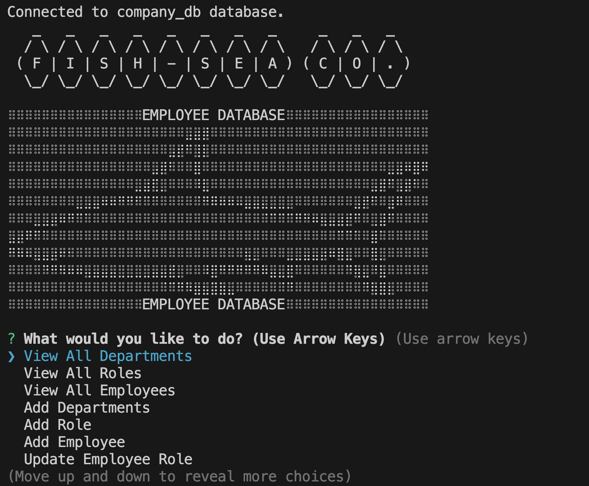

<div align="center">
  
  

  <h3 align="center">EMPLOYEE TRACKER</h3>

  <p align="center">
  The Fish-Sea Company seeks to implement an internal employee and department tracking system. This system is designed to operate within the terminal and is powered by MYSQL2, JavaScript, and Inquirer. The program allows use to view all employees, departments, and roles. It also allows the user to update and/or add departments and employees and roles.
  </p>

</div>


### Built With


<!-- GETTING STARTED -->
## Getting Started

Install the following to play with the program

### Prerequisites

Install <i>dependencies</i>.
  ```sh
  npm install
  ```


### Installation
1. Clone the repo
   ```sh
   git clone https://github.com/your_username_/Project-Name.git
   ```
2. Install NPM packages
   ```sh
   npm install
   ```
3. Run
    ```
    node index.js
    ```
4. Run mysql -u root -p and upload the db and seed.


<!-- LICENSE -->
## License

Distributed under the MIT License. See `LICENSE.txt` for more information.

<!-- CONTACT -->
## Contact

Nhi Hoang - [linkedin](https://www.linkedin.com/in/ynhihoang/)
Project Repo: [https://github.com/eviehoang/employee-tracker](https://github.com/eviehoang/employee-tracker)
Project Video: [google drive](https://drive.google.com/file/d/1uhmmA9l3UdXl2HbCesQdhQ-OLhBCf5Xu/view)


<!-- ACKNOWLEDGMENTS -->
## Acknowledgments

* [GitHub Emoji Cheat Sheet](https://www.webpagefx.com/tools/emoji-cheat-sheet)
* [Ileriaya Markdown-badges](https://github.com/Ileriayo/markdown-badges)
* [GitHub Pages](https://pages.github.com)
* [W3School](https://w3schools.com/graphics/svg_rect.asp) for tutorial codes and educational references.
* [MDN](https://developer.mozilla.org/en-US/) for example codes and educational references.
* ASKBCS Tutors: Jon and Jerromy
